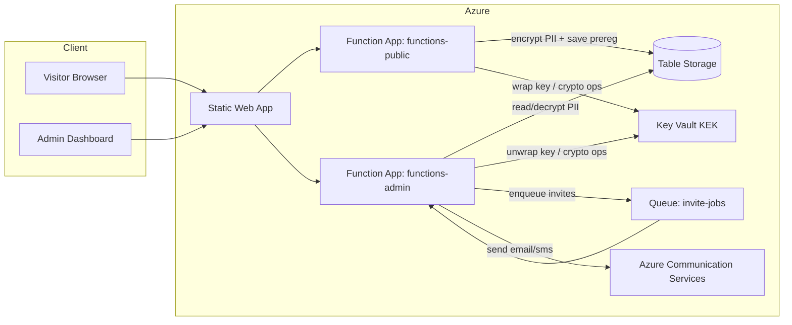
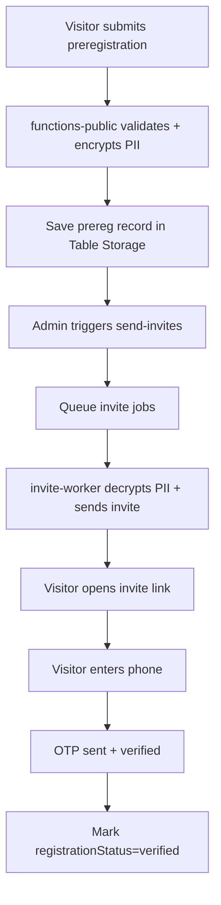

# amsterdam-750

Pre-registration platform voor Amsterdam 750. Bezoekers kunnen zich voorregistreren, een uitnodiging ontvangen, en vervolgens registreren met OTP-validatie.

Dit project is opgezet als portfolio-project met focus op:
- Azure Functions (public + admin)
- Key Vault-gebaseerde PII encrypt/decrypt
- CI/CD deployment naar Azure via GitHub Actions
- RBAC en managed identities

## Huidige status

### Al werkend

- End-to-end flow: preregister -> invite -> register -> OTP verify.
- PII wordt encrypted opgeslagen in Table Storage via `packages/shared/src/index.keyvault.pii.js`.
- Admin invite worker decrypt PII en verstuurt uitnodigingen via Azure Communication Services.
- OTP-success wordt persistent opgeslagen op de user-entity (`registrationStatus=verified`, `phoneVerifiedAt`).
- **Session retention**: OTP-formulier state wordt bewaard in URL en hersteld bij pagina-refresh.
- **Gebruiksvriendelijke OTP**: Drie invoervelden (2 cijfers elk) voor snellere invoer van 6-cijferige codes.
- **Betere feedback**: Directe visuele feedback bij SMS-verzoeken en error-foutmeldingen.
- **Refactored register-logica**: Functions-public register handler split in focused modules (handlers, database, communications, responses, utils).
- **Verbeterde error-handling**: OTP-fouten correct gerouteerd naar verification-error UI met proper validation en aria-live feedback.
- GitHub Actions deployt:
  - functions-admin via `.github/workflows/deploy-functions-admin.yml`
  - functions-public via `.github/workflows/deploy-functions-public.yml`
  - static web app via `.github/workflows/deploy-static-web-app.yml`

### Nog af te ronden voor "portfolio-complete"

- Volledige IaC-definitie in `infra/main.bicep` (nu nog placeholder), of expliciet blijven documenteren dat infrastructuur pre-provisioned is.
- Security hardening en auth-consistentie op admin endpoints (API keys/JWT validation).
- Extra testdekking voor edge cases (OTP timeout/retry limits, invalid phone formats, rate limiting).
- Production smoke tests en monitoring na deployment (Application Insights dashboards + alerts).

## Architectuur

```
apps/
  web/                  - Statische HTML/CSS/JS (htmx) op Azure Static Web Apps
  functions-public/     - Publieke Azure Functions (anonymous endpoints)
  functions-admin/      - Admin Azure Functions (invite/stats/worker)
  agent-assistant/      - Lokale AI-agent met tool-calls naar public/admin APIs
packages/
  shared/               - Gedeelde helpers: normalisatie, hashing, Key Vault PII wrapper
infra/
  main.bicep            - Infra-template (nog niet volledig uitgewerkt)
```

### Architectuurdiagram



### Procesflow (business)



## API overzicht

### functions-public (poort 7071)

| Route | Beschrijving |
|---|---|
| `POST /api/preregister` | Verwerkt pre-registratie formulier |
| `POST /api/register` | Valideert token + telefoon en rondt OTP-verificatie af |
| `GET /api/status` | Simpele publieke status endpoint |

### functions-admin (poort 7072)

| Route | Beschrijving |
|---|---|
| `GET /api/stats` | Dashboard statistieken (dagelijkse counts, tellers) |
| `POST /api/send-invites` | Queue't uitnodigingen voor alle eligible users |
| `POST /api/reset-preregistrations` | Reset invite-status van pre-registraties zodat `send-invites` opnieuw kan worden gedraaid; alleen met body `{ "confirm": true }` |
| `queue: invite-jobs -> invite-worker` | Verstuurt individuele uitnodiging en markeert status |

## Deployment model

Dit repository gebruikt momenteel een hybrid model:

- Applicatie deployment: volledig geautomatiseerd via GitHub Actions naar bestaande Azure resources.
- Infrastructuur provisioning: nog niet volledig als code in `infra/main.bicep`.

Dat betekent: code deploy is reproducible, infra provisioning nog niet volledig reproducible vanuit deze repo.

## Key Vault & PII

PII (naam, e-mail, telefoon) wordt encrypted opgeslagen in Table Storage.

- Key Encryption Key (KEK) in Azure Key Vault
- Envelope encryption via shared package
- Decrypt gebeurt alleen in admin-flow waar nodig (invite worker / register checks)

Belangrijke settings:

| Instelling | Beschrijving |
|---|---|
| `KV_URL` | `https://<vault-naam>.vault.azure.net` |
| `KEK_KEY_NAME` | Naam van de RSA key (bijv. `kek-prereg`) |
| `COMMUNICATIONS_SECRET_NAME` | Secret met ACS connection string |
| `EMAIL_FROM` | Gekoppeld ACS sender-adres (bijv. `DoNotReply@<...>.azurecomm.net`) |

## RBAC & managed identity (doelmodel)

Doelmodel voor productie:

### functions-public

| Resource | Rol |
|---|---|
| Storage account | Storage Table Data Contributor |
| Key Vault | Key Vault Crypto User |

### functions-admin

| Resource | Rol |
|---|---|
| Storage account | Storage Table Data Reader/Contributor (afhankelijk van write-behoefte) |
| Key Vault | Key Vault Crypto User |
| Key Vault | Key Vault Secrets User (voor Key Vault references) |

## Lokale ontwikkeling

Vereisten:
- Node.js (LTS)
- Azure Functions Core Tools v4 (`func`)
- Azurite (lokale Storage emulator)

Installatie:

```bash
npm install
```

Configuratie:

```powershell
copy apps\functions-public\local.settings.json.example apps\functions-public\local.settings.json
copy apps\functions-admin\local.settings.json.example  apps\functions-admin\local.settings.json
```

Start lokaal:

```bash
npm run start:all
```

### PreRegistrations resetten (testflow)

Gebruik dit endpoint om invite-status te resetten zodat dezelfde pre-registraties opnieuw meegenomen worden door `send-invites`:

- Endpoint: `POST /api/reset-preregistrations`
- Body: `{"confirm":true}` (verplicht, als extra safety check)
- Resultaat: `{ "ok": true, "reset": <aantal>, "tableName": "PreRegistrations" }`

Lokaal voorbeeld:

```powershell
curl -X POST "http://localhost:7072/api/reset-preregistrations" `
  -H "Content-Type: application/json" `
  -d "{\"confirm\":true}"
```

In Azure (niet-lokaal) moet je een function key meesturen omdat dit endpoint `authLevel: "function"` gebruikt.

### OTP debug mode (lokaal)

Voor sneller testen van de register/OTP stap kun je een vaste OTP-code gebruiken.

In `apps/functions-public/local.settings.json`:

```json
{
  "Values": {
    "OTP_FIXED_CODE": "123456",
    "OTP_DEBUG": "true"
  }
}
```

Betekenis:
- `OTP_FIXED_CODE`: als dit een geldige 6-cijferige code is, gebruikt de API deze i.p.v. een random OTP.
- `OTP_DEBUG=true`: logt extra OTP lifecycle events (sent, mismatch, expired, success).

Waarschuwing:
- Gebruik `OTP_FIXED_CODE` alleen lokaal en nooit in gedeelde of productie-omgevingen.

Snelle flow:
1. Start `functions-public` opnieuw na aanpassen van settings.
2. Doe register stap 1 (token + telefoon).
3. Vul bij stap 2 altijd `123456` in als OTP.

### OTP invoer UX

De OTP-pagina gebruikt drie invoervelden (elk 2 cijfers) voor de 6-cijferige code:
- **Auto-focus**: Na invulling van 2 cijfers springt cursor naar volgende veld.
- **Paste-ondersteuning**: Plak de gehele 6-cijferige code, velden worden automatisch ingevuld.
- **Select-all shortcut**: Ctrl+A selecteert alle velden; volgende invoer vervangt alles.
- **Keyboard navigation**: Pijltje-omhoog/omlaag schakelt tussen velden.
- **Session-behoud**: OTP-formulier state wordt in URL opgeslagen en hersteld bij refresh (geen herstart nodig).

Implementatie: `apps/web/public/register/register.js` met validator-events en HTMX-integratie.

Handige URLs:

| URL | Beschrijving |
|---|---|
| http://localhost:8080/preregister/ | Pre-registratieformulier |
| http://localhost:8080/register/ | Registratiepagina via invite token |
| http://localhost:8080/admin/ | Admin dashboard (lokale auth relaxed) |
| http://localhost:7071/api/preregister | Public API |
| http://localhost:7071/api/register | Register + OTP API |
| http://localhost:7072/api/stats | Admin API |

## Testen

Public flow test:

```bash
npm run -w apps/functions-public test -- src/functions/registration-flow.test.js
```

Admin integration test (vereist draaiende Azurite queue/table):

```bash
npx vitest run apps/functions-admin/src/functions/integration/invite-flow.integration.test.js
```

## Portfolio checklist

Must-have:
- End-to-end flow stabiel en aantoonbaar
- Geen test-only shortcuts in runtime code
- README met heldere architecture + security story
- Duidelijke keuze: volledige IaC of pre-provisioned infra expliciet documenteren
- Basis testbewijs (flow + belangrijke foutpaden)

Nice-to-have:
- Volledige Bicep infra
- Production smoke tests na deployment
- Diagrammen/screenshots van de flow
- Extra observability (App Insights dashboards + alerts)
