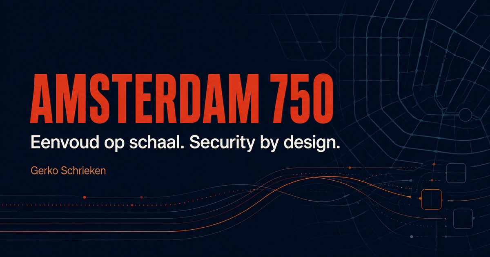

# Amsterdam 750 — Engineering Case Study

[](https://github.com/Gozzy82/amsterdam750-public/actions/workflows/deploy-pages.yml)

**A high-scale Azure pre-registration concept built to test a simple engineering question: can a registration peak be handled without keeping thousands of people waiting in a browser queue?**

[View the live case study](https://gozzy82.github.io/amsterdam750-public/) · [Load-test methodology](https://gozzy82.github.io/amsterdam750-public/evidence/load-test-methodology.html)



## What this project demonstrates

This portfolio project focuses on the engineering behind a secure, scalable pre-registration flow rather than on reproducing an entire ticketing platform.

It demonstrates:

- **Azure/serverless architecture** for bursty public traffic;
- **security by design** around personally identifiable information (PII);
- **application-level envelope encryption** with AES-256-GCM and Azure Key Vault;
- **Managed Identity and RBAC** to separate application and administrative access;
- **asynchronous processing** for work that does not need to happen in the user's request path;
- **anti-abuse controls**, including rate limiting, Turnstile and uniqueness locks;
- **progressive enhancement with HTMX**, keeping the browser flow deliberately small;
- **measured performance**, with the original Azure Load Testing artifacts published alongside the case study.

The design deliberately keeps the public registration path small: validate the request, store the minimum required data securely, return quickly, and move follow-up work out of the peak request path.

## Measured result

A published five-minute Azure Load Testing run used **250 virtual users** and produced:

| Metric | Result |
| --- | ---: |
| Successful registration POSTs | **126,124** |
| Failed registration POSTs | **0** |
| Registration throughput | **420.57 req/s** |
| Registration p95 | **634 ms** |
| Successful CORS preflights | **126,129** |
| Total HTTP requests | **252,253** |

The registration assertions checked both the HTTP 200 response and the expected success markup/confirmation text. These numbers describe this specific controlled load-test run; they are not presented as a universal production capacity claim.

The repository includes the original sanitized Azure/JMeter input, result and log archives, a calculated JSON summary and SHA-256 checksums under [`public/evidence/artifacts/`](public/evidence/artifacts/).

## Architecture at a glance

```text
Browser + HTMX
      │
      ▼
Public Azure Function
      │
      ├── validation / anti-abuse / rate limiting
      │
      ▼
Azure Table Storage ───── Azure Key Vault
 encrypted PII              wrapped keys
      │
      ▼
Queue / worker
      │
      ├── invitation flow
      └── e-mail / SMS / OTP
```

The case study explains the trade-offs in more detail, including why the public flow and privileged decryption flow are separated and why encryption alone is not treated as a complete security model.

## Why the frontend is intentionally small

The public portfolio site uses semantic HTML and CSS and is built with Vite. The original pre-registration concept used HTMX-style server-driven interaction because the flow is primarily forms and navigation rather than a state-heavy browser application.

That choice is part of the case study: use React when rich client state justifies it, but do not introduce a client runtime merely because it is familiar.

## Portfolio-site implementation

This repository contains the **public engineering case study**, not private production infrastructure or real user data.

- Vite builds `index.html` and `styles.css` to `dist/`.
- `@cloudflare/vite-plugin` configures an assets-only Cloudflare-compatible build.
- `build/sites-vite-plugin.ts` copies only required hosting metadata into the build artifact.
- `public/evidence/load-test-methodology.html` documents the test methodology, definitions and limitations.
- `public/evidence/artifacts/` contains sanitized source evidence for the published load-test result.
- GitHub Pages deploys `main` only after typecheck, lint, build and automated HTML/link/asset tests succeed.

The earlier Next.js/vinext, React, D1, Drizzle and ChatGPT-auth scaffolding was removed because the public case-study site does not need it.

## Run locally

Requires Node.js 22.13 or newer.

```text
npm install
npm run dev
```

Quality/build commands:

```text
npm run typecheck  TypeScript checks for Vite/build configuration
npm run lint       ESLint for configuration and tests
npm run build      Production build
npm test           Build + rendered HTML/link/asset tests
npm start          Production preview
```

## Public-data policy

This repository is intentionally suitable for public viewing. Do not commit secrets, tokens, real personal data or unsanitized test data. The evidence artifacts published here are the sanitized files used to substantiate the case study.

## Links

- **Live case study:** https://gozzy82.github.io/amsterdam750-public/
- **Repository:** https://github.com/Gozzy82/amsterdam750-public
- **Load-test methodology:** https://gozzy82.github.io/amsterdam750-public/evidence/load-test-methodology.html
